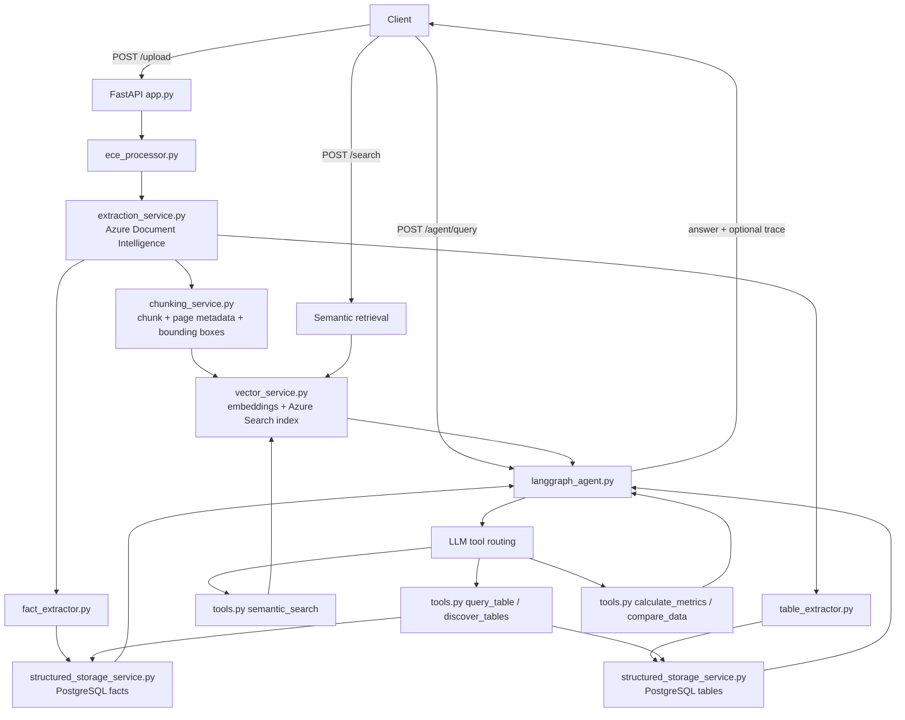

# Standalone ECE + LangGraph Service

Production-ready standalone service for:
- PDF ingestion and processing (**Extract → Chunk → Embed → Structured Store**)
- Semantic search over Azure Cognitive Search
- Structured retrieval from PostgreSQL
- LangGraph agentic querying with tool traces

---

## 1) What this service does

This module is a self-contained API app that supports two query modes:

1. **Direct retrieval**
   - `POST /search` for semantic vector search
2. **Agentic retrieval (LangGraph)**
   - `POST /agent/query` for tool-routed reasoning over vector + structured data

It processes PDFs through a dual-storage pipeline:

- **Vector DB (Azure Cognitive Search)** for semantic discovery and citations
- **PostgreSQL** for exact table/fact querying

---

## 2) High-level flow

### Ingestion flow (`POST /upload`)
1. **Extract** with Azure Document Intelligence (`extraction_service.py`)
2. **Chunk** text/tables with metadata + bounding boxes (`chunking_service.py`)
3. **Embed + index** chunks in Azure Search (`vector_service.py`)
4. **Extract structured facts/tables** and store in PostgreSQL (`fact_extractor.py`, `table_extractor.py`, `structured_storage_service.py`)

### Query flow (`POST /agent/query`)
1. User question enters LangGraph (`langgraph_agent.py`)
2. Model chooses tools from `tools.py`
3. Tool results are fed back to model until final grounded answer is produced
4. Optional `debug: true` returns full trace (`tool_calls`, `tool_results`, ordered `events`)

### End-to-end lifecycle diagram



---

## 3) Code structure

```text
standalone_ece/
├── app.py                       # FastAPI app + endpoints
├── langgraph_agent.py           # LangGraph graph + tool-calling loop + trace builder
├── tools.py                     # 8 async tools used by agent
├── ece_processor.py             # End-to-end ingestion orchestrator
├── extraction_service.py        # Azure Document Intelligence extraction
├── chunking_service.py          # Chunking + metadata + bounding boxes
├── vector_service.py            # Azure Search indexing + semantic retrieval
├── structured_storage_service.py# PostgreSQL storage/query layer
├── fact_extractor.py            # Structured fact extraction
├── table_extractor.py           # Structured table extraction
├── llm_middleware.py            # OpenAI / Azure OpenAI client selection
├── config.py                    # Environment config loader + validation
├── requirements.txt
├── Dockerfile
├── .dockerignore
├── .gitignore
├── .env.example
└── QUICKSTART.md
```

---

## 4) Agent tools available

`tools.py` exposes these tools to LangGraph:

1. `semantic_search`
2. `lookup_fact`
3. `query_table`
4. `discover_tables`
5. `get_table_info`
6. `calculate_metrics`
7. `get_source_citation`
8. `compare_data`

---

## 5) Storage format

Data is stored in two stores. Shapes below are what the pipeline writes and what the API returns.

**Vector DB (Azure Cognitive Search)**  
Chunks are indexed with: `id`, `title`, `content`, `contentVector`, `file_id`, `file_name`, `namespace`, `page_number` (string form of a list, e.g. `"[1]"`), `bounding_box` (JSON string), `page_info`.  
Search results (`POST /search`, `semantic_search`): `page_number` is returned as a **list of integers**; `bounding_box` as a **dict**. Each hit includes `content`, `file_name`, `page_number`, `bounding_box`, `score`.

**PostgreSQL – Facts table** (`facts`): `id`, `file_id`, `file_name`, `namespace`, `entity_type`, `value` (varchar 500, stored as string), `page`, `source_quote`, `confidence`, `created_at`. `lookup_fact` filters by `entity_type`, `namespace`, `page`, `file_id`.

**PostgreSQL – Tables table** (`tables`): `id`, `table_id`, `file_id`, `file_name`, `namespace`, `headers` (JSONB), `data` (JSONB), `metadata` (JSONB), `created_at`. `metadata` includes `table_index`, `has_headers`, and `page_number` (for citations). `get_source_citation` uses `metadata.page_number` for table citations.

---

## 6) API endpoints

### `GET /health`
Service health check.

### `POST /upload`
Upload and process PDF through full ECE pipeline.

### `POST /search`
Semantic search only (direct vector retrieval).

### `POST /agent/query`
LangGraph agent query.

Request:
```json
{
  "query": "Compare cybersecurity jobs trend and give citation",
  "namespace": "cyber-ireland-2022",
  "max_steps": 8,
  "debug": true
}
```

Response (debug mode includes trace):
```json
{
  "status": "success",
  "query": "...",
  "namespace": "cyber-ireland-2022",
  "steps": 3,
  "answer": "...",
  "trace": {
    "events": [],
    "tool_calls": [],
    "tool_results": []
  }
}
```

---

## 7) Environment variables

Copy `.env.example` to `.env` and set required values.

### Required
- `AZURE_AFR_API_KEY`
- `AZURE_AFR_ENDPOINT`
- `AZURE_SEARCH_ENDPOINT`
- `AZURE_SEARCH_KEY`
- `OPENAI_API_KEY` (or Azure OpenAI credentials if vendor switched)
- `POSTGRES_URI`

### Common optional
- `AZURE_INDEX_NAME`
- `EMBEDDING_MODEL`
- `VECTOR_SEARCH_DIMENSIONS`
- `ACTIVE_LLM_VENDOR`
- `CHUNK_SIZE`
- `BUFFER_SIZE`
- `HOST`
- `PORT`

---

## 8) Local run

Use **Python 3.11 or 3.12** (3.14 is not supported by tiktoken/pydantic-core). Create the venv with a supported interpreter, e.g. `python3.12 -m venv venv`, then:

```bash
cd standalone_ece
pip install -r requirements.txt
python app.py
```

Server default: `http://localhost:8001`

---

## 9) Docker deployment

Build:
```bash
docker build -t standalone-ece .
```

Run:
```bash
docker run --env-file .env -p 8001:8001 standalone-ece
```

---

## 10) Useful test calls

### Upload
```bash
curl -X POST "http://localhost:8001/upload" \
  -F "file=@/path/to/document.pdf" \
  -F "namespace=cyber-ireland-2022"
```

### Agent query with trace
```bash
curl -X POST "http://localhost:8001/agent/query" \
  -H "Content-Type: application/json" \
  -d '{
    "query": "Compare cybersecurity jobs trend and give citation",
    "namespace": "cyber-ireland-2022",
    "debug": true
  }'
```

---

## 11) Operational notes

- If `discover_tables` returns 0, structured tables are not yet stored for that namespace.
- If `lookup_fact` returns 0, fact extraction patterns may not match document layout.
- Use `debug: true` on agent endpoint to inspect routing/tool behavior.
- Service cleanup is handled on shutdown for vector, postgres, and LLM clients.

- Run `python export_for_evaluation.py` to export all chunks and PostgreSQL tables/facts to `export_evaluation/` for storage and retrieval evaluation.
- Run `python scripts/run_test_queries_and_save_traces.py` after uploading the PDF to generate execution logs in `execution_logs/` (see that folder's README). For architecture justification and limitations see ARCHITECTURE_AND_LIMITATIONS.md.
